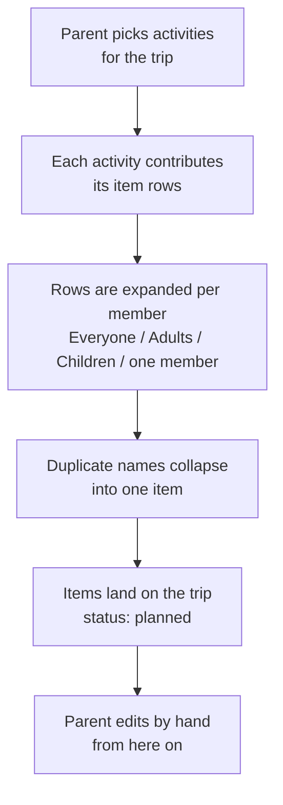

# Activity catalogue (draft)

**Status:** draft, not yet specced or built. Feeds **milestones 04 to 06** (see [How this is split](#how-this-is-split)). Drafting this surfaced the Family-items problem (see [open item A3](#open-items)), which was split out into milestone 03 because it changes what an item is. Serves [`user-flows.md`](user-flows.md) step 1 ("plan what activities we're doing") and step 2 ("plan what to pack based on that").

This file exists to answer one question before any code is written: *if we had this, would the packing list it produces actually be the list we'd write by hand?* It drafts the activities, the items behind them, and a worked example trip so the result can be judged on paper. Each milestone spec comes after its part of this file is agreed.

## How this is split

Three milestones, each usable on its own. "Family" means only the Family bucket from milestone 03 ([A11](#open-items)); the sources of generated items are called Basics, Shared activities and Personal activities.

| # | Milestone | What the family gets | What it adds to the app | Deliberately left out |
|---|---|---|---|---|
| 04 | [Basics](#basics) | A new trip already holds each person's basics and the Family bucket's, sized to the trip's length | Items created together with the trip; per-day quantities ([A2](#open-items)) | Choosing anything: basics are always on. Merging duplicate names, since one source per owner cannot overlap with itself. |
| 05 | [Shared activities](#shared-activities) | Pick swimming, beach, etc. while creating the trip | Choosing activities on the trip form; merging duplicate names across sources ([towel problem](#overlap-the-towel-problem)) | Choosing who takes part |
| 06 | [Personal activities](#personal-activities) | "I'm going running" brings only the runner's gear | Choosing an activity's participants while creating the trip ([A8](#open-items)) | Adding participants after the trip exists ([A9](#open-items)) |

Activities are chosen only while creating the trip, and are never added or removed afterwards ([A4](#open-items), [A9](#open-items)). Anything forgotten is added as an individual item, which milestone 01 already supports.

Basics carry most of the value (see [the worked example](#what-the-example-shows), point 2), which is why they go first.

## The idea in one line

A trip is a set of activities. Each activity knows what it needs. Selecting the activities produces the items, so the same swimsuit decision is not made from scratch every trip.

The catalogue is fixed and seeded, like the family members are. Editing activities is a later milestone; this one is about whether the fixed content is any good.

## How an activity entry is written

Every activity is a list of rows. A row is a name, a quantity, and who it is for.

| Column | Values | Notes |
|---|---|---|
| Item | free text | This is the name that appears on the packing list. Singular ("Dress, 2", not "Dresses, 2"), and one name per object everywhere in the catalogue ("Hairbrush", never also "Brush"), or dedup and cross-trip reuse fail ([A13](#open-items), see [Overlap](#overlap-the-towel-problem)). |
| Qty | a number, or `n/day` | `1/day` on a 3-night trip means 4 (days, not nights). See [Quantity](#quantity-fixed-or-per-day). |
| Who | `Everyone`, `Adults`, `Children`, a named member, `Family` | `Family` means one for the whole trip, not one each. Where it is stored is milestone 03's job, not this one's. |

The four members are fixed and seeded: Parent 1, Parent 2, Child 1, Child 2 (see [`domain-model.md`](domain-model.md)). `Adults` = Parents 1 and 2, `Children` = Children 1 and 2.

---

## Basics

Milestone 04. Not chosen, always on. This is the part that is boring to redo every trip, so it carries most of the value. It is also where `n/day` matters most: underwear for a weekend and underwear for a week are different lists.

Each person has their own list, written out in full, because the lists share only about half their items ([A10](#open-items)). The lists are fixed in 04; letting parents adjust them is a later milestone.

Accepted for 04 ([A12](#open-items)): basics ignore the season, and trips created before 04 get no basics. A seasonal item is written generically: Child 1's "Hat" is a woolly hat in winter and a cap in summer, and the parent picks which when packing. Seasonal trip planning is a later milestone.

The children's day clothes are one row, "Outfit", because they are packed as a bundle per day and the bundle is what gets ticked ([A16](#open-items)). An outfit is a top (a t-shirt or a dress) and trousers. Underwear, socks and long-sleeved shirts stay separate rows. What goes into each bundle is decided when packing.

### Parent 1

Reviewed by Parent 1, 2026-09-25.

| Item | Qty |
|---|---|
| Underwear | 1/day + 1 |
| Socks | 1/day + 1 |
| T-shirt | 1/day |
| Sweatpants | 1 |
| Khakis | 1 |
| Belt | 1 |
| Long-sleeved shirt | 1 |
| Hoodie | 1 |
| Outdoor jacket | 1 |
| Hat | 1 |
| Gloves | 1 |
| Shoes | 2 |
| Toothbrush | 1 |
| Water bottle | 1 |
| Phone charger | 1 |
| Wallet and keys | 1 |
| Deodorant | 1 |

### Parent 2

Quick edit by Parent 1; to be reviewed with Parent 2.

| Item | Qty |
|---|---|
| Underwear | 1/day + 1 |
| Socks | 1/day + 2 |
| T-shirt | 1/day |
| Trousers | 2 |
| Jumper | 1 |
| Long-sleeved shirt | 1 |
| Pyjamas | 1 |
| Outdoor jacket | 1 |
| Hat | 1 |
| Gloves | 1 |
| Shoes | 2 |
| Toothbrush | 1 |
| Hairbrush | 1 |
| Water bottle | 1 |
| Phone charger | 1 |
| Wallet and keys | 1 |

### Child 1

Reviewed by Parent 1 and Parent 2, 2026-09-25. Underwear is 2/day + 1 because Child 1 is potty training and changes more often.

| Item | Qty |
|---|---|
| Underwear | 2/day + 1 |
| Socks | 1/day + 1 |
| Outfit | 1/day + 1 |
| Long-sleeved shirt | 2 |
| Hat | 1 |
| Gloves | 1 |
| Pyjama dress | 1 |
| Pyjama pants | 1 |
| Pyjama socks | 1 |
| Outdoor jacket | 1 |
| Outdoor overalls | 1 |
| Shoes | 2 |
| Toothbrush | 1 |
| Water bottle | 1 |
| Small towel | 1 |
| Sleep toy | 4 |
| Hairbrush | 1 |
| Hair spray | 1 |
| Hair tie | 1/day |

### Child 2

Reviewed by Parent 1 and Parent 2, 2026-09-25.

| Item | Qty |
|---|---|
| Socks | 1/day + 1 |
| Outfit | 1/day + 1 |
| Long-sleeved shirt | 2 |
| Hat | 1 |
| Gloves | 1 |
| Pyjamas | 1 |
| Outdoor jacket | 1 |
| Outdoor overalls | 1 |
| Shoes | 2 |
| Toothbrush | 1 |
| Water bottle | 1 |
| Sleep toy | 1 |
| Sleeping bag | 1 |
| Pacifier | 2 |
| Small towel | 1 |
| Nappies | 6/day |
| Hairbrush | 1 |

### Family

Quick edit by Parent 1; to be reviewed with Parent 2.

| Item | Qty |
|---|---|
| Kids toothpaste | 1 |
| Adults toothpaste | 1 |
| Wet wipes | 1 |
| Painkillers | 1 |
| Double stroller | 1 |
| Stroller rain cover | 2 |

The double stroller comes on every trip, with one rain cover per seat ([A14](#open-items)). A light single stroller for some trips is added as an individual item. There is no first aid kit on purpose: the medical things are too big for one kit and are listed as individual items, starting with painkillers ([A15](#open-items)).

---

## Where we sleep: out of scope

Decided (Human-PM): an activity is strictly *what we do*, not where we sleep. Cottage, hotel, camping and staying with relatives were drafted here and have been cut. They are a different kind of choice (you pick exactly one, and it mostly changes what the *place* supplies rather than what you do there), so folding them into the same list would have made "select the activities" mean two things at once. If accommodation earns a feature later it gets its own milestone and its own field.

---

## Shared activities

Milestone 05. Things the family does together. A row can still be for a subset (goggles for the adults and Child 1), but the activity itself is picked for the whole family.

### Swimming

| Item | Qty | Who |
|---|---|---|
| Swimsuit | 1 | Everyone |
| Towel | 1 | Everyone |
| Flip flops | 1 | Everyone |
| Goggles | 1 | Adults, Child 1 |
| Float vest | 1 | Children |
| Swim nappy | 2 | Children |
| Shampoo | 1 | Family |
| Bag for wet swimsuits | 1 | Family |

### Sauna

Short on purpose. Almost everything it needs, swimming already brought.

| Item | Qty | Who |
|---|---|---|
| Towel | 1 | Everyone |
| Flip flops | 1 | Everyone |
| Shampoo | 1 | Family |

### Beach day

| Item | Qty | Who |
|---|---|---|
| Sun hat | 1 | Everyone |
| Towel | 1 | Everyone |
| Sand toys | 1 | Children |
| Sunscreen | 1 | Family |
| Picnic blanket | 1 | Family |
| Cool bag | 1 | Family |
| Snacks | 1 | Family |

### Hiking

| Item | Qty | Who |
|---|---|---|
| Hiking boots | 1 | Everyone |
| Rain jacket | 1 | Everyone |
| Rain trousers | 1 | Everyone |
| Sit pad | 1 | Everyone |
| Backpack | 1 | Adults |
| Child carrier | 1 | Family |
| Thermos | 1 | Family |
| Trail snacks | 1 | Family |
| Mosquito repellent | 1 | Family |
| Plasters | 1 | Family |

### Snow play

| Item | Qty | Who |
|---|---|---|
| Winter jacket | 1 | Everyone |
| Winter boots | 1 | Everyone |
| Mittens | 2 | Everyone |
| Woolly hat | 1 | Everyone |
| Neck warmer | 1 | Everyone |
| Wool socks | 2 | Everyone |
| Snowsuit | 1 | Children |
| Ski trousers | 1 | Adults |
| Sledge | 1 | Family |
| Thermos | 1 | Family |

### Downhill skiing

Assumes snow play is also selected; this adds only the gear on top of the warm clothes.

| Item | Qty | Who |
|---|---|---|
| Skis | 1 | Everyone |
| Ski boots | 1 | Everyone |
| Helmet | 1 | Everyone |
| Ski goggles | 1 | Everyone |
| Base layer | 2 | Everyone |
| Ski passes | 1 | Family |

### City day

| Item | Qty | Who |
|---|---|---|
| Small backpack | 1 | Adults |
| Change of clothes | 1 | Children |
| Umbrella | 1 | Family |
| Snacks | 1 | Family |

### Eating out

| Item | Qty | Who |
|---|---|---|
| Nicer outfit | 1 | Everyone |
| Quiet toy | 1 | Children |
| Bib | 2 | Child 2 |

### Long car drive

| Item | Qty | Who |
|---|---|---|
| Travel pillow | 1 | Everyone |
| Tablet and headphones | 1 | Children |
| Blanket | 1 | Children |
| Window sunshade | 2 | Family |
| Car snacks | 1 | Family |
| Sick bags | 2 | Family |

---

## Personal activities

Milestone 06. Something one or some of us do, not the whole family. Rows have no Who column: they apply to whoever the activity is chosen for on the trip form ([A8](#open-items)).

### Running

Drafted unverified.

| Item | Qty |
|---|---|
| Running shoes | 1 |
| Running clothes | 1/day |
| Sports watch | 1 |

---

## Candidates, not drafted yet

Named so the list is visibly incomplete on purpose, and so we can see whether the shape above stretches to cover them: cycling, fishing, cross-country skiing, berry picking, boating, amusement park, birthday party, ice swimming, festival.

---

## Worked example: does it produce the right list?

**Trip:** Parainen, Friday to Sunday, 3 days / 2 nights. **Activities selected:** Swimming. Basics are always on. One tap in total. Per-day quantities use 3 (days, not nights).

This replaces an earlier 4-day Punkaharju example with four activities, which counted the drafted basics before they were reviewed.

### The list

Every member side by side, so a gap between them is visible: a blank cell means that person gets no such item. Quantities are after the per-day multiplication. No name appears in both the basics and swimming for the same person, so nothing collapses on this trip.

| Item | From | Parent 1 | Parent 2 | Child 1 | Child 2 | Family |
|---|---|---|---|---|---|---|
| Underwear | Basics | 4 | 4 | 7 |  |  |
| Socks | Basics | 4 | 5 | 4 | 4 |  |
| T-shirt | Basics | 3 | 3 |  |  |  |
| Sweatpants | Basics | 1 |  |  |  |  |
| Khakis | Basics | 1 |  |  |  |  |
| Belt | Basics | 1 |  |  |  |  |
| Long-sleeved shirt | Basics | 1 | 1 | 2 | 2 |  |
| Hoodie | Basics | 1 |  |  |  |  |
| Outdoor jacket | Basics | 1 | 1 | 1 | 1 |  |
| Hat | Basics | 1 | 1 | 1 | 1 |  |
| Gloves | Basics | 1 | 1 | 1 | 1 |  |
| Shoes | Basics | 2 | 2 | 2 | 2 |  |
| Toothbrush | Basics | 1 | 1 | 1 | 1 |  |
| Water bottle | Basics | 1 | 1 | 1 | 1 |  |
| Phone charger | Basics | 1 | 1 |  |  |  |
| Wallet and keys | Basics | 1 | 1 |  |  |  |
| Deodorant | Basics | 1 |  |  |  |  |
| Trousers | Basics |  | 2 |  |  |  |
| Jumper | Basics |  | 1 |  |  |  |
| Pyjamas | Basics |  | 1 |  | 1 |  |
| Hairbrush | Basics |  | 1 | 1 | 1 |  |
| Outfit | Basics |  |  | 4 | 4 |  |
| Pyjama dress | Basics |  |  | 1 |  |  |
| Pyjama pants | Basics |  |  | 1 |  |  |
| Pyjama socks | Basics |  |  | 1 |  |  |
| Outdoor overalls | Basics |  |  | 1 | 1 |  |
| Small towel | Basics |  |  | 1 | 1 |  |
| Sleep toy | Basics |  |  | 4 | 1 |  |
| Hair spray | Basics |  |  | 1 |  |  |
| Hair tie | Basics |  |  | 3 |  |  |
| Sleeping bag | Basics |  |  |  | 1 |  |
| Pacifier | Basics |  |  |  | 2 |  |
| Nappies | Basics |  |  |  | 18 |  |
| Kids toothpaste | Basics |  |  |  |  | 1 |
| Adults toothpaste | Basics |  |  |  |  | 1 |
| Wet wipes | Basics |  |  |  |  | 1 |
| Painkillers | Basics |  |  |  |  | 1 |
| Double stroller | Basics |  |  |  |  | 1 |
| Stroller rain cover | Basics |  |  |  |  | 2 |
| Swimsuit | Swimming | 1 | 1 | 1 | 1 |  |
| Towel | Swimming | 1 | 1 | 1 | 1 |  |
| Flip flops | Swimming | 1 | 1 | 1 | 1 |  |
| Goggles | Swimming | 1 | 1 | 1 |  |  |
| Float vest | Swimming |  |  | 1 | 1 |  |
| Swim nappy | Swimming |  |  | 2 | 2 |  |
| Shampoo | Swimming |  |  |  |  | 1 |
| Bag for wet swimsuits | Swimming |  |  |  |  | 1 |

### Totals

| Bucket | From basics | From swimming | Total |
|---|---|---|---|
| Parent 1 | 17 | 4 | 21 |
| Parent 2 | 16 | 4 | 20 |
| Child 1 | 19 | 6 | 25 |
| Child 2 | 17 | 5 | 22 |
| Family | 6 | 2 | 8 |
| **Total** | **75** | **21** | **96** |

### What the example shows

1. **A weekend with one activity is 96 rows**, more than the 88 the old 4-day, four-activity example reached. The growth came from the reviewed basics, not from activities. So if the list turns out too long ([A5](#open-items)), the basics are where it would have to get leaner.
2. **The basics carry the value.** 75 of 96 rows come from them, including every row that scales with the trip's length (underwear, socks, t-shirts, outfits, hair ties, nappies). If only the basics shipped, most of the list would already exist.
3. **Two towels per child is correct.** The basics' "Small towel" is for washing and swimming's "Towel" is for swimming, so the different names keeping them apart is intended.
4. **The per-day spares hold up on a short trip.** `1/day + 1` gives 4 pairs of underwear for 2 nights, and Child 2 gets 18 nappies; Human-PM confirmed both match a real weekend bag. Swim nappies were the exception: they follow swimming sessions, not days, so they are a fixed 2 per child.

## Design questions the draft ran into

### Overlap: the towel problem

Cottage, Swimming, Sauna and Beach day each want a towel. If they are named "Towel", "Swim towel", "Sauna towel" and "Beach towel", the list gets four rows for what is really two towels. If they are all named "Towel", they collapse to one row, and one towel for a 4-day cottage trip with a sauna is too few.

Proposal: dedup by name (case-insensitive, which the item table already enforces per member) and keep the **highest** quantity, not the sum. Reasoning: a list with one honest "Towel, 2" row that a parent bumps to 3 by hand is better than three rows that each look like a separate towel. The cost of being wrong is one edit; the cost of three towel rows is confusion every time.

This makes **naming discipline part of the catalogue's job**. Two activities that mean the same object must spell it the same way.

### Quantity: fixed or per day

`Underwear, 4 pcs` is wrong for a week and wrong for a weekend. The exact pain the user described is not re-deciding *which* items, it is re-deciding *how many*. A fixed number means the parent edits underwear, socks and t-shirts on every single trip, which is most of the problem left unsolved.

Proposal: a row's quantity is either a fixed number or a per-day number, and the trip's duration is already stored (`domain-model.md`). It is one nullable column and one multiplication. This is the one place where the extra field looks worth it, and it is [open item A2](#open-items) because it is a scope call, not a technical one.

### When are activities chosen, and can they change

Decided (Human-PM): **activities are chosen while creating the trip, and cannot be changed afterwards**, and this holds beyond one milestone: activities are never added to an existing trip either ([A9](#open-items)). This removes the preset-vs-linked question entirely: with no unselect there is no removal to design, no "which items came from this activity" link to store for that purpose, and no rule needed for items that have been edited, hand-added or already packed. The trip form is also the natural place for it: you know what the trip is for at the moment you create it.

The escape hatch moves down a level. You cannot un-choose swimming, but you can delete the swimsuit rows it produced, using the per-item remove that milestone 01 already built.

**The consequence worth pricing.** A mis-tapped activity is paid for by hand, per item. Snow play on a July trip produces 30 rows (6 items for each of 4 people, 2 for the children, 2 for the adults, 2 for the family), and there is currently no way to delete a trip either (`sql/queries/trip.sql` has ListTrips, CreateTrip and GetTrip, no delete). So today the only recovery from one wrong tap is 30 taps.

Three ways to close that, cheapest first:

| Option | Cost | Note |
|---|---|---|
| Add trip deletion | One DELETE query plus a confirm; `item.trip_id` already cascades | Fixes "I created this trip wrong" in general, not just activities. Recommended. |
| Review step in the trip form | Layout work, no schema | Catches a mis-tap before it becomes rows, but not after |
| "Remove this activity's items" | Needs the item-to-activity link back | Reintroduces exactly what this decision avoided |

**Storing the selection is still worth it**, even though it is immutable. It costs one small join table and buys two things: the trip page can show what the trip is for, and the post-trip review (the distinguishing goal in [`user-flows.md`](user-flows.md)) can eventually ask "were the swimming items ever useful?" That question is unanswerable if the activities are only a generation step that leaves no trace.

### One more: what is this list for

Two philosophies, and the catalogue above picked one without asking:

- **Complete list** (what is drafted): everything that goes in the bag, including socks and a toothbrush. Long, but it is the list you tick through while packing, which is what milestone 02 built.
- **Reminder list**: only the things that get forgotten. Twenty rows, not a hundred. Faster, but it is not a packing list and the milestone 02 packing page would half-empty.

The drafted catalogue assumes the first, because milestone 02 already built a page for ticking through everything. Flagged so the assumption is visible, not because it looks wrong.

---

## Open items

Decided by Human-PM, 2026-09-20:

| # | Question | Decision |
|---|---|---|
| A1 | Are "where we sleep" options activities? | **No.** An activity is strictly what we do. Accommodation is out of scope for this milestone; the drafted entries are cut. |
| A2 | Are per-day quantities in scope? | **Yes.** A row's quantity is a fixed number or a per-day number, multiplied by the trip's duration. |
| A3 | Where do `Family` items live? | **Its own milestone, before activities.** "Family" is the term. Activity planning becomes milestone 04 and can assume the bucket already exists. |
| A4 | Preset (one-way add) or linked (unselect removes)? | **Neither: activities are chosen at trip creation and cannot be changed afterwards.** See [When are activities chosen](#when-are-activities-chosen-and-can-they-change). |
| A7 | One mis-tapped activity can cost ~30 manual deletions, and trips cannot be deleted either. | **Accepted as a known issue, not addressed now.** Revisit if it actually happens on a real trip; the three ways to close it are recorded above, with trip deletion the cheapest. |

Decided by Human-PM, 2026-09-25:

| # | Question | Decision |
|---|---|---|
| A9 | Can activities be added to a trip after it is created? | **No.** Activities are chosen only on the trip form. Anything forgotten is added as an individual item. |
| A11 | "Family" was about to mean the bucket, the basics and the shared activities. Rename? | **Yes.** "Family" means only the bucket. The sources are Basics, Shared activities and Personal activities. |
| A8 | Are personal activities their own milestone (06), with a participant picker on the trip form? | **Yes.** Chosen over folding fixed-person activities into 05. |
| A10 | Basics written per person, or as a shared base plus per-person differences? | **Per person, written out.** Fixed in 04; parents adjusting their basics is a later milestone. |
| A12 | Basics ignore the season, and trips created before 04 get no basics. OK? | **Yes, both accepted** for milestone 04. A seasonal basic is written generically ("Hat" = woolly hat or cap). Seasonal trip planning is a later milestone. |
| A13 | Naming rule for catalogue items? | **Singular names, one name per object** across the whole catalogue. |
| A14 | Keep Pushchair in City day, now that a double stroller is in the Family basics? | **No, removed.** The double stroller is the default; a light single stroller is added by hand when a trip needs it. |
| A15 | Family basics dropped the first aid kit. Deliberate? | **Yes.** Medical things are listed as individual items because they do not fit one kit. |
| A16 | How are the children's day clothes, which vary by day (t-shirt and trousers, or dress and trousers), written? | **One "Outfit, 1/day + 1" row per child**, because the family packs a bundle per day. Outfit = a top (t-shirt or dress) and trousers. Considered and rejected: generic slots (Top / Bottom per day), and outfits as groups of items, which would need a new entity. |

Still open:

| # | Question | Draft's assumption |
|---|---|---|
| A5 | Is ~88 generated rows the right outcome, or should the list be leaner? | Complete list, matching what milestone 02 packs. The [worked example](#worked-example-does-it-produce-the-right-list) reaches 96 rows on a one-activity weekend, 75 of them from the basics. |
| A6 | Is the content right: activities missing, ones you would never pick, wrong items? | Drafted unverified; review before milestone 05. Known clashes with the new basics: Child 1's "Hat" vs Snow play's "Woolly hat" and Beach's "Sun hat"; Parent 1's khakis and long shirt vs Eating out's "Nicer outfit". |
