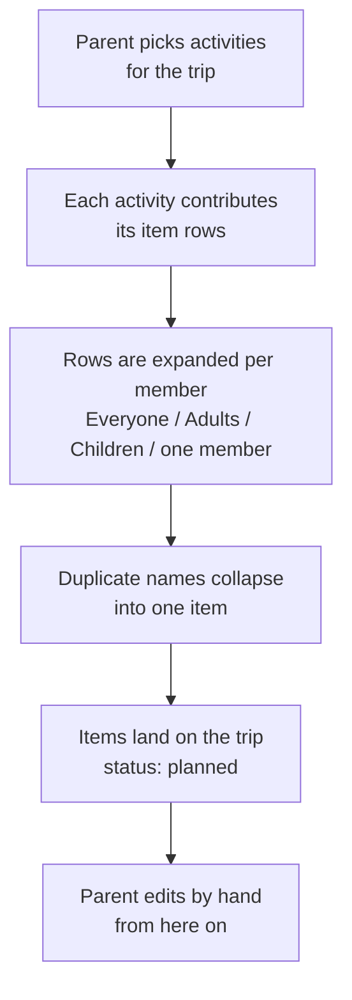

# Activity catalogue (draft)

**Status:** draft, not yet specced or built. Feeds **milestone 04**, not 03: drafting this
surfaced the Family-items problem (see [open item A3](#open-items)), which was split out into
milestone 03 because it changes what an item is. Serves [`user-flows.md`](user-flows.md)
step 1 ("plan what activities we're doing") and step 2 ("plan what to pack based on that").

This file exists to answer one question before any code is written: *if we had this, would
the packing list it produces actually be the list we'd write by hand?* It drafts the
activities, the items behind them, and a worked example trip so the result can be judged on
paper. The milestone spec (`milestones/03-*.md`) comes after this is agreed.

## The idea in one line

A trip is a set of activities. Each activity knows what it needs. Selecting the activities
produces the items, so the same swimsuit decision is not made from scratch every trip.

The catalogue is fixed and seeded, like the family members are. Editing activities is a
later milestone; this one is about whether the fixed content is any good.

## How an activity entry is written

Every activity is a list of rows. A row is a name, a quantity, and who it is for.

| Column | Values | Notes |
|---|---|---|
| Item | free text | This is the name that appears on the packing list. Names must match across activities, or dedup fails (see [Overlap](#overlap-the-towel-problem)). |
| Qty | a number, or `n/day` | `1/day` on a 3-night trip means 4 (days, not nights). See [Quantity](#quantity-fixed-or-per-day). |
| Who | `Everyone`, `Adults`, `Children`, a named member, `Family` | `Family` means one for the whole trip, not one each. Where it is stored is milestone 03's job, not this one's. |

The four members are fixed and seeded: Parent 1, Parent 2, Child 1, Child 2
(see [`domain-model.md`](domain-model.md)). `Adults` = Parents 1 and 2, `Children` =
Children 1 and 2.

---

## Always applied

### Everyday basics

Not chosen, always on. This is the part that is boring to redo every trip, so it carries
most of the value. It is also where `n/day` matters most: underwear for a weekend and
underwear for a week are different lists.

| Item | Qty | Who |
|---|---|---|
| Underwear | 1/day + 1 | Everyone |
| Socks | 1/day + 1 | Everyone |
| T-shirt | 1/day | Everyone |
| Trousers | 2 | Everyone |
| Jumper | 1 | Everyone |
| Pyjamas | 1 | Everyone |
| Outdoor jacket | 1 | Everyone |
| Toothbrush | 1 | Everyone |
| Water bottle | 1 | Everyone |
| Comfort toy | 1 | Children |
| Nappies | 6/day | Child 2 |
| Phone charger | 1 | Adults |
| Wallet and keys | 1 | Adults |
| Toothpaste | 1 | Family |
| Hairbrush | 1 | Family |
| Wet wipes | 1 | Family |
| First aid kit | 1 | Family |

---

## Where we sleep: out of scope

Decided (Human-PM): an activity is strictly *what we do*, not where we sleep. Cottage, hotel,
camping and staying with relatives were drafted here and have been cut. They are a different
kind of choice (you pick exactly one, and it mostly changes what the *place* supplies rather
than what you do there), so folding them into the same list would have made "select the
activities" mean two things at once. If accommodation earns a feature later it gets its own
milestone and its own field.

The cut removes the single largest source of Family items from the worked example below,
which is worth re-checking once milestone 03 lands.

---

## What we do there

### Swimming

| Item | Qty | Who |
|---|---|---|
| Swimsuit | 1 | Everyone |
| Towel | 1 | Everyone |
| Flip flops | 1 | Everyone |
| Goggles | 1 | Adults, Child 1 |
| Float vest | 1 | Children |
| Swim nappy | 2/day | Child 2 |
| Shampoo | 1 | Family |
| Bag for wet swimsuits | 1 | Family |

### Sauna

Short on purpose. Almost everything it needs, swimming already brought.

| Item | Qty | Who |
|---|---|---|
| Towel | 1 | Everyone |
| Flip flops | 1 | Everyone |
| Shampoo | 1 | Family |

### Beach day

| Item | Qty | Who |
|---|---|---|
| Sun hat | 1 | Everyone |
| Towel | 1 | Everyone |
| Sand toys | 1 | Children |
| Sunscreen | 1 | Family |
| Picnic blanket | 1 | Family |
| Cool bag | 1 | Family |
| Snacks | 1 | Family |

### Hiking

| Item | Qty | Who |
|---|---|---|
| Hiking boots | 1 | Everyone |
| Rain jacket | 1 | Everyone |
| Rain trousers | 1 | Everyone |
| Sit pad | 1 | Everyone |
| Backpack | 1 | Adults |
| Child carrier | 1 | Family |
| Thermos | 1 | Family |
| Trail snacks | 1 | Family |
| Mosquito repellent | 1 | Family |
| Plasters | 1 | Family |

### Snow play

| Item | Qty | Who |
|---|---|---|
| Winter jacket | 1 | Everyone |
| Winter boots | 1 | Everyone |
| Mittens | 2 | Everyone |
| Woolly hat | 1 | Everyone |
| Neck warmer | 1 | Everyone |
| Wool socks | 2 | Everyone |
| Snowsuit | 1 | Children |
| Ski trousers | 1 | Adults |
| Sledge | 1 | Family |
| Thermos | 1 | Family |

### Downhill skiing

Assumes snow play is also selected; this adds only the gear on top of the warm clothes.

| Item | Qty | Who |
|---|---|---|
| Skis | 1 | Everyone |
| Ski boots | 1 | Everyone |
| Helmet | 1 | Everyone |
| Ski goggles | 1 | Everyone |
| Base layer | 2 | Everyone |
| Ski passes | 1 | Family |

### City day

| Item | Qty | Who |
|---|---|---|
| Small backpack | 1 | Adults |
| Change of clothes | 1 | Children |
| Pushchair | 1 | Family |
| Umbrella | 1 | Family |
| Snacks | 1 | Family |

### Eating out

| Item | Qty | Who |
|---|---|---|
| Nicer outfit | 1 | Everyone |
| Quiet toy | 1 | Children |
| Bib | 2 | Child 2 |

### Long car drive

| Item | Qty | Who |
|---|---|---|
| Travel pillow | 1 | Everyone |
| Tablet and headphones | 1 | Children |
| Blanket | 1 | Children |
| Window sunshade | 2 | Family |
| Car snacks | 1 | Family |
| Sick bags | 2 | Family |

---

## Candidates, not drafted yet

Named so the list is visibly incomplete on purpose, and so we can see whether the shape
above stretches to cover them: cycling, fishing, cross-country skiing, berry picking,
boating, amusement park, birthday party, ice swimming, festival.

---

## Worked example: does it produce the right list?

**Trip:** cottage in Punkaharju, 4 days / 3 nights, July.
**Activities selected:** Swimming, Sauna, Beach day, Long car drive.
Everyday basics is always on. Four taps in total. (Where the family sleeps no longer
contributes anything, per the cut above.)

### What Parent 1 ends up with

Personal items, 17 of them:

| Item | Qty | From |
|---|---|---|
| Underwear | 5 | Basics (1/day + 1) |
| Socks | 5 | Basics (1/day + 1) |
| T-shirt | 4 | Basics (1/day) |
| Trousers | 2 | Basics |
| Jumper | 1 | Basics |
| Pyjamas | 1 | Basics |
| Outdoor jacket | 1 | Basics |
| Toothbrush | 1 | Basics |
| Water bottle | 1 | Basics |
| Phone charger | 1 | Basics |
| Wallet and keys | 1 | Basics |
| Swimsuit | 1 | Swimming |
| Towel | 1 | Swimming + Sauna + Beach (collapsed) |
| Flip flops | 1 | Swimming + Sauna (collapsed) |
| Goggles | 1 | Swimming |
| Sun hat | 1 | Beach |
| Travel pillow | 1 | Car |

Family items, 13 of them: toothpaste, hairbrush, wet wipes, first aid kit, shampoo, bag for
wet swimsuits, sunscreen, picnic blanket, cool bag, snacks, window sunshade, car snacks,
sick bags.

### Totals for the trip

| Bucket | Items |
|---|---|
| Parent 1 | 17 |
| Parent 2 | 17 |
| Child 1 | 20 |
| Child 2 | 21 |
| Family | 13 |
| **Total** | **88** |

### What the example shows

1. **Four taps produce ~88 items.** Milestone 02 already sized the packing page for ~120
   items, so this is not a new scale problem, but it is a very different feeling: today
   items arrive one at a time and each one was a decision. Whether an 88-row list is a
   relief or a wall is the real question, and it is [open item A5](#open-items).
2. **The Family bucket is 13 rows, a seventh of the trip.** Cutting accommodation took it
   down from 22, so it is no longer the biggest single block, but it is still more than
   half of what a parent carries personally. Parked on Parent 1 it would inflate that
   parent's list by 75% and make milestone 02's "pack only my things" filter misleading.
   This is why it became milestone 03 and goes first.
3. **The basics carry the value.** 11 of Parent 1's 17 personal rows come from the always-on
   list, and the four that scale with duration (underwear, socks, t-shirts) are exactly the
   ones that are re-decided every trip. If only the basics shipped and no activities at all,
   most of the "same socks every trip" pain would be gone. Worth knowing when sizing 04.
4. **Sauna earned its place by being nearly empty.** Its three rows all collapse into rows
   swimming already added. An activity that adds nothing new is still a correct answer; it
   just means the catalogue is well factored.

## Design questions the draft ran into

### Overlap: the towel problem

Cottage, Swimming, Sauna and Beach day each want a towel. If they are named "Towel",
"Swim towel", "Sauna towel" and "Beach towel", the list gets four rows for what is really
two towels. If they are all named "Towel", they collapse to one row, and one towel for a
4-day cottage trip with a sauna is too few.

Proposal: dedup by name (case-insensitive, which the item table already enforces per member)
and keep the **highest** quantity, not the sum. Reasoning: a list with one honest "Towel, 2"
row that a parent bumps to 3 by hand is better than three rows that each look like a
separate towel. The cost of being wrong is one edit; the cost of three towel rows is
confusion every time.

This makes **naming discipline part of the catalogue's job**. Two activities that mean the
same object must spell it the same way.

### Quantity: fixed or per day

`Underwear, 4 pcs` is wrong for a week and wrong for a weekend. The exact pain the user
described is not re-deciding *which* items, it is re-deciding *how many*. A fixed number
means the parent edits underwear, socks and t-shirts on every single trip, which is most of
the problem left unsolved.

Proposal: a row's quantity is either a fixed number or a per-day number, and the trip's
duration is already stored (`domain-model.md`). It is one nullable column and one
multiplication. This is the one place where the extra field looks worth it, and it is
[open item A2](#open-items) because it is a scope call, not a technical one.

### When are activities chosen, and can they change

Decided (Human-PM): **activities are chosen while creating the trip, and cannot be changed
afterwards** in this milestone. This removes the preset-vs-linked question entirely: with no
unselect there is no removal to design, no "which items came from this activity" link to
store for that purpose, and no rule needed for items that have been edited, hand-added or
already packed. The trip form is also the natural place for it: you know what the trip is for
at the moment you create it.

The escape hatch moves down a level. You cannot un-choose swimming, but you can delete the
swimsuit rows it produced, using the per-item remove that milestone 01 already built.

**The consequence worth pricing.** A mis-tapped activity is paid for by hand, per item. Snow
play on a July trip produces 30 rows (6 items for each of 4 people, 2 for the children, 2 for
the adults, 2 for the family), and there is currently no way to delete a trip either
(`sql/queries/trip.sql` has ListTrips, CreateTrip and GetTrip, no delete). So today the only
recovery from one wrong tap is 30 taps.

Three ways to close that, cheapest first:

| Option | Cost | Note |
|---|---|---|
| Add trip deletion | One DELETE query plus a confirm; `item.trip_id` already cascades | Fixes "I created this trip wrong" in general, not just activities. Recommended. |
| Review step in the trip form | Layout work, no schema | Catches a mis-tap before it becomes rows, but not after |
| "Remove this activity's items" | Needs the item-to-activity link back | Reintroduces exactly what this decision avoided |

**Storing the selection is still worth it**, even though it is immutable. It costs one small
join table and buys two things: the trip page can show what the trip is for, and the post-trip
review (the distinguishing goal in [`user-flows.md`](user-flows.md)) can eventually ask "were
the swimming items ever useful?" That question is unanswerable if the activities are only a
generation step that leaves no trace.

### One more: what is this list for

Two philosophies, and the catalogue above picked one without asking:

- **Complete list** (what is drafted): everything that goes in the bag, including socks and
  a toothbrush. Long, but it is the list you tick through while packing, which is what
  milestone 02 built.
- **Reminder list**: only the things that get forgotten. Twenty rows, not a hundred. Faster,
  but it is not a packing list and the milestone 02 packing page would half-empty.

The drafted catalogue assumes the first, because milestone 02 already built a page for
ticking through everything. Flagged so the assumption is visible, not because it looks
wrong.

---

## Open items

Decided by Human-PM, 2026-09-20:

| # | Question | Decision |
|---|---|---|
| A1 | Are "where we sleep" options activities? | **No.** An activity is strictly what we do. Accommodation is out of scope for this milestone; the drafted entries are cut. |
| A2 | Are per-day quantities in scope? | **Yes.** A row's quantity is a fixed number or a per-day number, multiplied by the trip's duration. |
| A3 | Where do `Family` items live? | **Its own milestone, before activities.** "Family" is the term. Activity planning becomes milestone 04 and can assume the bucket already exists. |
| A4 | Preset (one-way add) or linked (unselect removes)? | **Neither: activities are chosen at trip creation and cannot be changed afterwards.** See [When are activities chosen](#when-are-activities-chosen-and-can-they-change). |
| A7 | One mis-tapped activity can cost ~30 manual deletions, and trips cannot be deleted either. | **Accepted as a known issue, not addressed now.** Revisit if it actually happens on a real trip; the three ways to close it are recorded above, with trip deletion the cheapest. |

Still open:

| # | Question | Draft's assumption |
|---|---|---|
| A5 | Is ~88 generated rows the right outcome, or should activities be leaner? | Complete list, matching what milestone 02 packs. Parked until milestone 03 lands. |
| A6 | Is the content right: activities missing, ones you would never pick, wrong items? | Drafted unverified. Kept as-is for review after milestone 03. |
