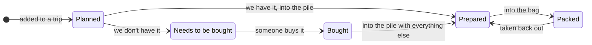

# Domain model

Shared entities across milestones. One definition per entity; milestone specs link here.

- Family member: either one of the 4 fixed people in the family (two adults and two young children, in that seed order), or the Family bucket, one further row meaning "the whole family, not a person" (see `milestones/03-family-items.md`). The four people are seeded, not editable, and separate from app users (children own items but never log in). The repository is public, so the migration seeds placeholder names for the people and the real ones come from `FAMILY_NAMES` at startup (see `.env.example`); the bucket's name, "Family", is fixed and is not one of the names `FAMILY_NAMES` supplies.
- Trip: destination, departure date, duration in days. The return date is derived, not stored: departure + duration − 1 (the departure day counts).
- Item: one thing taken on a trip by a family member, either a person or the Family bucket: trip + owner + name + quantity, plus where it is in its lifecycle (see below). Reuse across trips is by name.
- Basic item: one of the items every new trip starts with (see `milestones/04-trip-basics.md`): owner (a person or the Family bucket, by id, never by name) + catalogue position + name + quantity as so many per day plus a fixed number. Stored in the `basic_item` table, seeded by a migration. Creating a trip copies each basic into the trip as an ordinary item, with quantity per day x trip days + fixed; after that the item has no link back to its basic. The app is the source of truth for the basics; `activity-catalogue.md` is where changes are discussed and may drift from what the app holds.

## Item lifecycle

The item in real life goes through a defined lifecycle. It is planned, then either we already have it or we don't and it has to be bought. Everything converges on `Prepared`, the pile where the trip's things are gathered (step 3 in [`user-flows.md`](user-flows.md)), and is packed from there. A bought item joins the pile like any other; it does not go from the grocery bag straight into the duffel bag.

`Needs to be bought → Bought` is a detour off the main line, not a second route to the bag. Only `Prepared` leads to `Packed`.

### Undoing a step

Items come back out of the bag, and an unpacked item always returns to `Prepared`: it is back in the pile, not back to being an open question. Because every packed item came from `Prepared`, undoing is unambiguous.

What the lifecycle does not keep is *why* an item is in the pile. The moment a bought item moves to `Prepared`, the fact that it was bought for this trip is gone. If the post-trip review wants "what did we have to buy", that has to be recorded separately, and it is not recoverable from the status, whichever option below is chosen.

### How this is stored

**One status field per item**, walking the diagram above: `planned` → `prepared` → `packed`, with the `needs_buying` → `bought` detour off `planned`. The diagram is the schema.

- Nothing contradictory is representable: an item cannot be packed while we don't own it.
- Undoing is a plain transition back (`packed` → `prepared`), not a restore from history, because every packed item came from the same place.

The alternative considered was a separate `packed` yes/no flag alongside an availability status. It was rejected once the lifecycle converged on `Prepared`: a second field earns its keep only when unpacking has more than one possible destination, which it does not.

Milestone 02 (`milestones/02-pack-items.md`) implements the `planned` ⇄ `packed` part of this field only; `prepared`, `needs_buying` and `bought` arrive in a later milestone. Until `prepared` exists, an unpacked item returns to `planned`, the same transition, with the middle of the chain not yet built.
